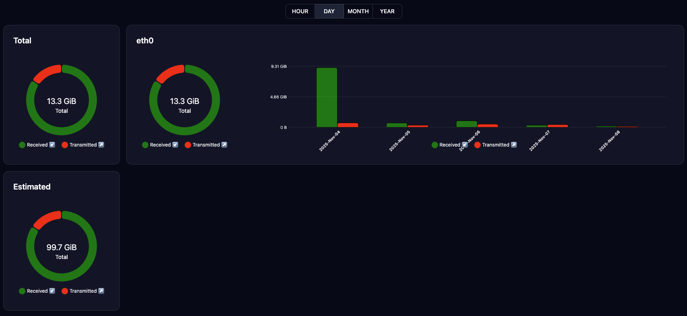
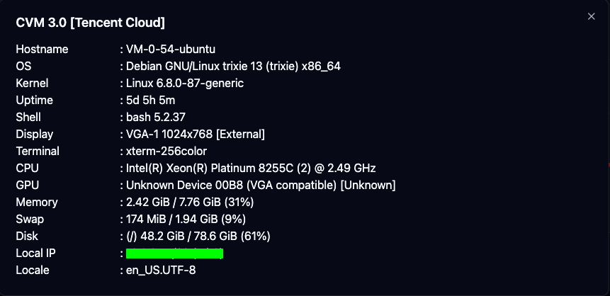

# VPS Dashboard

SvelteKit-powered frontend for the VPS Dashboard. It proxies API requests to your backend/agent and signs calls with an HMAC token.




## Features

- Network traffic and estimates via `vnstat`.
- System information via `fastfetch` (OS, CPU/GPU, memory, disk, local IP, uptime, and more).

## Quick Start

- Copy `.env.example` to `.env` and adjust values.
- Install dependencies: `bun install`
- Start dev: `bun run dev`

## Docker

- Pull with `docker pull ariefsn/vps-dashboard:latest`.
- Run the container (set your envs, ensure vnstat available in the running environment):

```
docker run --rm -p 5173:5173 \
  -e APP_NAME="VPS-Dashboard" \
  -e SALT=CHANGE_ME_TO_MATCH_AGENT_SALT \
  -e PLAYGROUND=false \
  -e HOST=0.0.0.0 \
  -e PORT=5173 \
  ariefsn/vps-dashboard
```

- If you need a Docker Compose setup, see https://github.com/ariefsn/vps
- The agent is here https://github.com/ariefsn/vps-agent

## Environment

Required variables (see `.env.example`):

```env
APP_NAME=VPS Dashboard
ORIGIN=http://localhost:5173        # Your frontend origin (dev)
API_URL=http://localhost:3100       # Backend/agent base URL
SALT=CHANGE_ME_TO_MATCH_AGENT_SALT  # MUST match the agent's SALT
```

Important: `SALT` must be the exact same value used by your agent service. The app generates a token using `HMAC-SHA256(timestamp, SALT)` and includes it in requests; a mismatch will cause authentication failures.

## Adapters

Default adapter is Bun (`svelte-adapter-bun`).

## License

Licensed under the [Apache License 2.0](./LICENSE).  
© 2025 Arief Setiyo Nugroho

## Thanks to

- <a href="https://www.flaticon.com/free-icons/report" title="report icons">Report icons created by Design Circle - Flaticon</a>
